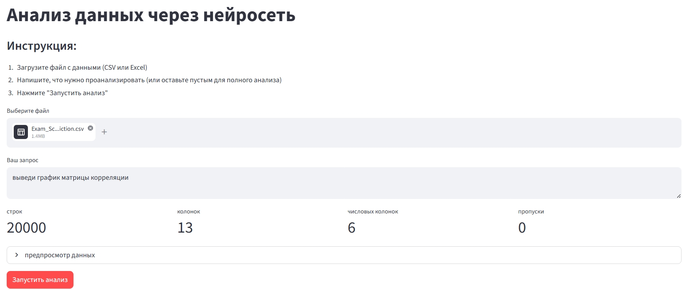
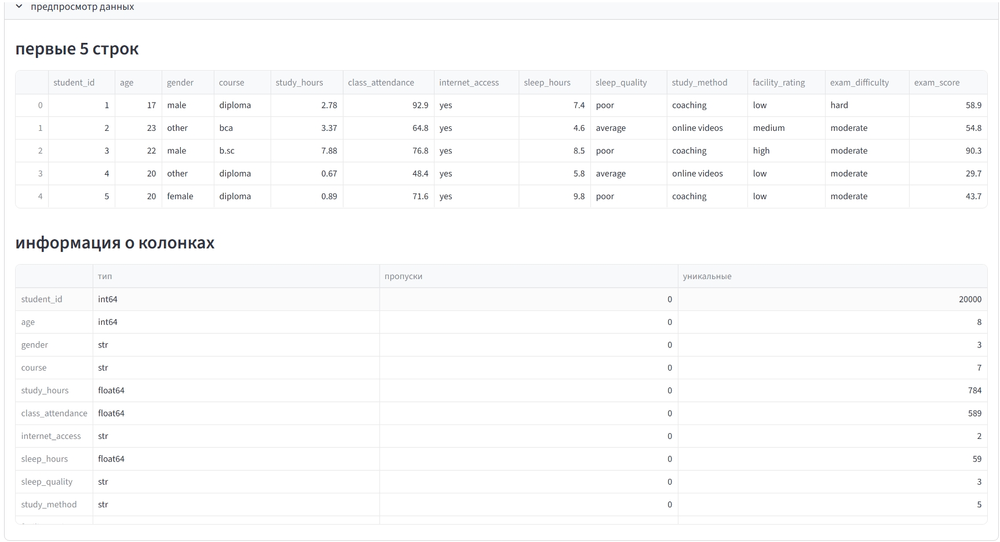
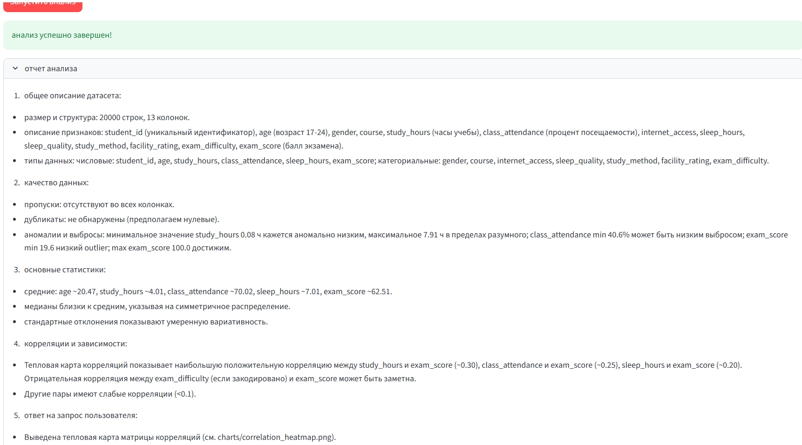
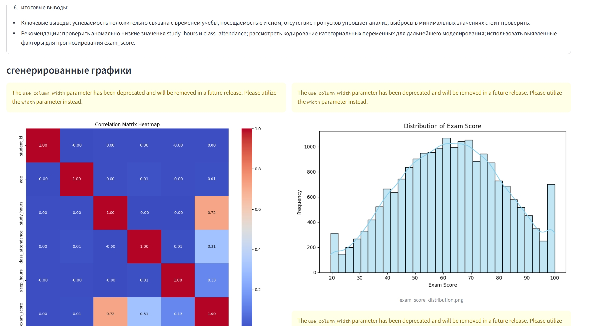
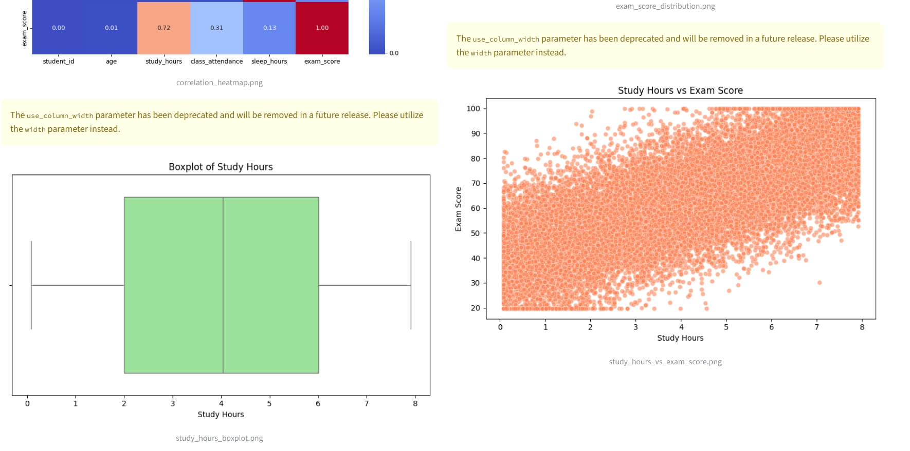

# Аналитик данных, задание 3
### Б9123-02.03.01сцт Алиева С.Н

## Описание задачи
Создание веб-интерфейса на базе Streamlit для решения задачи анализа данных
с помощью ИИ-агента. Веб-интерфейс позволяет пользователю загрузить файл
с данными и отображает результаты анализа
## Структура проекта
    taska3/
    ├── app.py
    ├── agent.py
    ├── requirements.txt
    ├── .gitignore
    ├── README.md
    ├── .env 
    └── charts/ 
    └── images/
        ├── img1.jpeg
        ├── img2.jpeg
        ├── img3.jpeg
        └── img4.jpeg   
        └── img5.jpeg   
## Запуск проекта
### 1. клонировать репозиторий
```bash
git clone https://github.com/SevaAlieva/3taska.git
```
### 2. создать виртуальное окружение
```bash
    python -m venv venv
```
### 3. установить зависимости
```bash
pip install -r requirements.txt
```
### 4. настроить API ключ 
    создать файл .env:

        OPENROUTER_API_KEY=sk-or-v1-ваш_ключ
### 5. запустить приложение
```bash
streamlit run app.py
```
### Как пользоваться
#### 1. загрузить датасет - CSV или Excel файл с данными
#### 2. написать запрос - что нужно проанализировать (или оставить пустым для полного анализа)
#### 3. нажать "Запустить анализ" - агент сам напишет код, выполнит его и вернет результат

## Интерфейс приложения(+загрузка данных и запрос)

## Предпросмотр данных и общая информация

## Результаты анализа и графики


